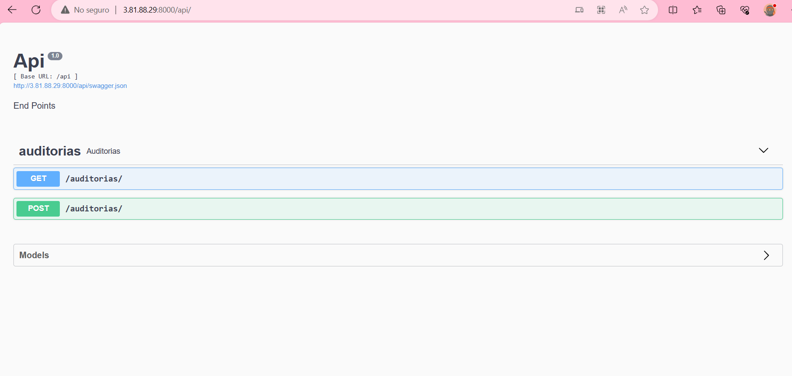

## Python 3.9.10

### Crear un archivo .env en la raiz del proyecto basandose en el archivo .env-example

# Correr proyecto local windows

- pip install virtualenv 
- virtualenv venv
- .\venv\Scripts\activate
- pip install -r requirements.txt
- python app.py

## Intefaz de swagger

# Proyecto local corriendo

### Run Project with docker

- ` docker build -t flask_api -f develop.Dockerfile . `
- ` docker run -p 8000:8000 flask_api `

## Correr en una maquina ec2

- Iniciar instancia ec2 amazon linux t2.micro 
- Conectarse a la instancia mediante SSH y instalar
    - ` sudo yum install git -y `
- Clonar el repositorio
    - git clone https://github.com/Rojas-Andres/api-flask.git
- Entrar a la carpeta donde se clono el repo y crear el archivo .env 
- Instalar docker
    - sudo yum install docker
- Correr los comandos para iniciar docker
    - ` sudo service docker start `
    - ` docker build -t flask_api -f develop.Dockerfile . `
    - ` docker run -p 8000:8000 flask_api `

## Anotaciones 
- Recordar que si se para el servidor la ip publica va a cambiar entonces por lo tanto la url a la que se va acceder cambiara